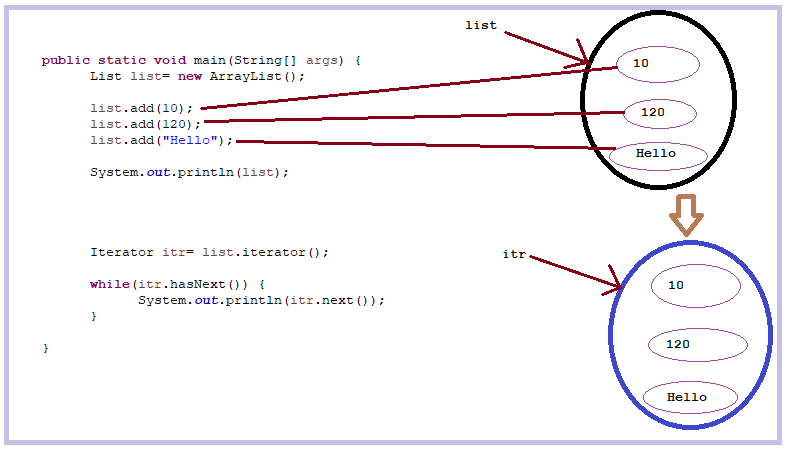
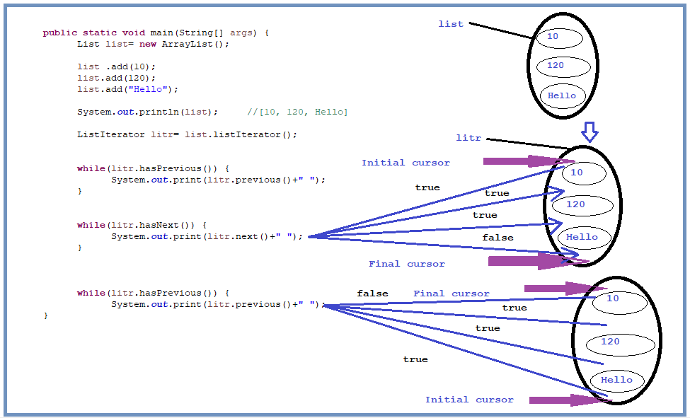

# Cursor

>Cursor is an iterator that is used to traverse, retrieve collection streams or objects.

3 types of Cursor.
1. Iterator
2. ListIterator
3. Enumeration

### Iterator
* Iterator traverse only in forward order.

```java
	public static void main(String[] args) {
		List list= new ArrayList();
		
		list.add(10);
		list.add(120);
		list.add("Hello");
		
		System.out.println(list);   //[10, 120, Hello]
		
		Iterator itr= list.iterator();
		
		while(itr.hasNext()) {				// returning a boolean value
			System.out.println(itr.next()); //returning an object
		}
        /*
        10
        120
        Hello
		*/
	}
```



* Iterator cursor can be applied on any collection objects.

### ListIterator
* ListIterator traverse in both forward and backward order.

```java
	public static void main(String[] args) {
		List list= new ArrayList();
		
		list .add(10);
		list.add(120);
		list.add("Hello");
		
		System.out.println(list); 	//[10, 120, Hello]
		
		ListIterator litr= list.listIterator();
		
		while(litr.hasPrevious()) {
			System.out.print(litr.previous()+" ");	//cursor is placed before first element 10. So hasPrevious()
													//method has not found any previous element and printing nothing
		}
		
		while(litr.hasNext()) {
			System.out.print(litr.next()+" ");	//10 120 Hello
		}
		//cursor is at the end of the list
		
		while(litr.hasPrevious()) {
			System.out.print(litr.previous()+" ");	//Hello 120 10
													//cursor traverse from last to first
		}
	}
```



* ListIterator cursor can be applied only on List implemented classes.