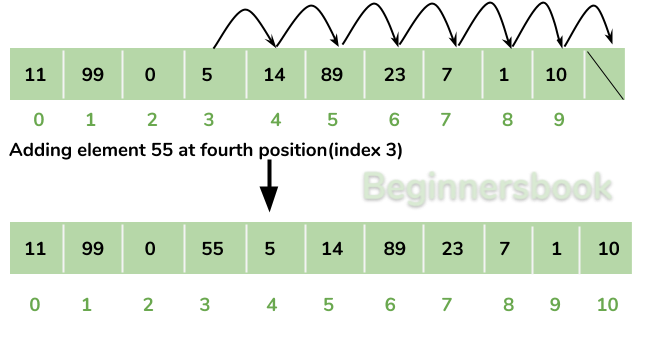

# Differences between ArrayList and LinkedList

ArrayList and LinkedList are both implementations of the List interface in Java, but they have different underlying data structures and performance characteristics. Here are the key differences between ArrayList and LinkedList:

* **Underlying Data Structure:**  
**ArrayList:** It is based on a dynamic array, which means elements are stored in a contiguous block of memory. The array size grows dynamically as elements are added.  
**LinkedList:** It is based on a doubly linked list, where each element is stored in a node that contains references to the previous and next nodes.

* **Insertion and Removal:**  
**ArrayList:** Insertion and removal of elements at the beginning or middle of the list require shifting subsequent elements, resulting in slower performance. Adding or removing elements at the end of the list is faster since it doesn't require shifting.

**LinkedList:** Insertion and removal of elements anywhere in the list are efficient because it only requires updating the links between nodes. Adding or removing elements at the beginning or end of the list is particularly fast.

* **Random Access:**  
**ArrayList:** Provides fast random access to elements by index. Retrieving an element by index has a constant time complexity of O(1).  
**LinkedList:** Does not provide direct random access. To access an element, you need to traverse the list from the beginning or end until you reach the desired position. Accessing an element by index has a time complexity of O(n), where n is the index of the element.

* **Memory Overhead:**  
**ArrayList:** It has a smaller memory overhead compared to LinkedList because it only needs to store the elements and an underlying array.    
**LinkedList:** It has a larger memory overhead compared to ArrayList because it needs to store the elements and maintain the links between nodes.

* **Iteration:**  
**ArrayList:** Iteration over elements using an iterator or enhanced for loop is efficient since it provides direct access to elements by index.  
**LinkedList:** Iteration over elements is slightly slower compared to ArrayList because it requires traversing the list node by node.

* **Performance Trade-offs:**  
**ArrayList:** It is efficient for scenarios where random access to elements or iteration is frequently performed. It is suitable when the size of the list is known in advance or when adding or removing elements at the end of the list is more common.  
**LinkedList:** It is efficient for scenarios that involve frequent insertion or removal of elements in the middle of the list. It is suitable when the size of the list may vary dynamically or when adding or removing elements at the beginning or middle is more common.

In summary, ArrayList provides fast random access and is suitable when the size is known in advance or when elements are frequently accessed or iterated over. On the other hand, LinkedList is efficient for frequent insertion or removal of elements anywhere in the list, especially in the middle. The choice between ArrayList and LinkedList depends on the specific requirements of your use case.

