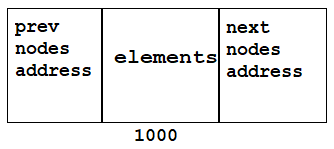

# LinkedList
>LinkedList is an implemented class of List interface which belongs to `java.util` package.

```java
public class LinkedList<E>
    extends AbstractSequentialList<E>
    implements List<E>, Deque<E>, Cloneable, java.io.Serializable
```

**Properties:**
* **Linked Structure:** A LinkedList consists of nodes, where each node contains a data element and references to the previous and next nodes in the list. This linked structure allows for efficient insertion and removal of elements anywhere in the list.



* **Dynamic Size:** Similar to an ArrayList, a LinkedList can dynamically grow or shrink in size to accommodate elements. It does not require pre-allocation of memory and adjusts the size as elements are added or removed.

* **Ordered:** LinkedList maintains the order of elements in which they are inserted. Each element is associated with its own node, and the nodes are linked together in a specific order.

* **No Random Access:** Unlike an ArrayList, LinkedList does not provide direct random access to elements by index. To access an element, you need to traverse the list starting from the first (head) or last (tail) node and follow the links until you reach the desired position. This makes LinkedList less efficient for random access but more efficient for insertion and removal of elements in the middle of the list.

* **Duplicates and Nulls:** Similar to ArrayList, LinkedList allows duplicate elements and can store null values.

* **Generics:** Like ArrayList, LinkedList is also a generic class, allowing you to specify the type of elements it will hold.

* **Methods:** LinkedList provides various methods to manipulate and access its elements. Some commonly used methods include add(), remove(), get(), set(), size(), contains(), indexOf(), and isEmpty(). These methods allow you to add elements, remove elements, retrieve elements, check if an element is present, find the index of an element, and perform other operations.

* **Performance:** LinkedList offers efficient performance for insertion and removal of elements at arbitrary positions in the list. Adding or removing elements at the beginning or end of the list is particularly fast, as it only requires updating the head or tail references. However, accessing elements by index is slower compared to ArrayList, as it requires traversing the list.

* **Iteration:** LinkedList provides an efficient way to iterate over its elements using the Iterator or enhanced for loop. The Iterator allows you to traverse the list forward or backward, making it easy to perform operations on each element.

* **Synchronization:** Like ArrayList, LinkedList is not synchronized, so it is not thread-safe. If you need to use a LinkedList in a multithreaded environment, consider using `java.util.concurrent.ConcurrentLinkedDeque` or synchronize the access to the LinkedList manually.

LinkedList is suitable for scenarios where frequent insertion or removal of elements is required, especially in the middle of the list. It is also useful when the size of the collection may vary dynamically. However, if random access to elements or memory efficiency is a priority, ArrayList may be a better choice.

[Click here](https://github.com/Jahid-Iqbal/Data-Structures-and-Algorithms/blob/main/Data%20Structures/LinkedList.md) to learn LinkedList in details